# AI 编程辅助开发：`Agent Skills` 技术分享

## 一、AI 编程认知基础

### 1.1 传统编程开发的痛点分析

作为开发者，经常会遇到这样的场景：

- 刚理清一个复杂业务流程，被打断后又得重新梳理思路

- 接手一个老项目，花了半天还没搞懂其中某个模块的设计思路

- 在不同项目间切换时，总要重新适应不同的编码规范和架构风格。

传统编程开发存在着这三种问题：

- 上下文切换成本高：需求理解→技术选型→代码实现→质量验证的切换过程中，每次都要重新构建认知框架。

- 知识传递效率低：项目规范、架构经验分散在文档和个人经验中，新成员上手或跨模块开发时处处碰壁。

- 开发流程割裂：需求→设计→编码→审查各环节串行传递，信息易失真且反馈滞后。

### 1.2 传统编程与 AI 编程的对比

传统编程与 AI 编程代表了两种不同的软件开发范式。传统编程以开发者为中心，强调对代码的精确控制和手动编写能力；而 AI 编程则以 AI 为辅助工具，强调人机协作，通过自然语言描述需求来生成和优化代码。两者并非替代关系，而是互补演进。

| 维度 | 传统编程 | AI 编程 |
|------|----------|---------|
| **交互方式** | 代码优先，通过编程语言与计算机对话 | 自然语言优先，通过描述需求与 AI 协作 |
| **代码来源** | 开发者逐行编写，依赖记忆和经验 | AI 根据需求生成，开发者审核优化 |
| **知识依赖** | 依赖开发者掌握的语言框架和 API | AI 具备广泛知识，开发者更多扮演指导角色 |
| **问题解决** | 开发者定位问题、构思方案、编写代码 | 开发者描述问题，AI 提供多种解决方案 |
| **学习曲线** | 需要记忆大量语法、框架和最佳实践 | 重点在于提问能力和方案评估能力 |
| **迭代速度** | 重复性代码编写耗时较长 | 代码生成快，聚焦于创造性工作 |
| **错误处理** | 依赖调试器和日志定位问题 | AI 可解释错误原因并提供修复建议 |
| **角色定位** | 开发者是执行者，全程参与 | 开发者是指挥者，关注决策和验收 |

**核心差异总结**：

传统编程中，开发者需要同时扮演"架构师"和"码农"的角色，既要设计方案，又要手动实现。而 AI 编程重新定义了这种分工——开发者转向需求理解、方案设计和代码审查，将重复性编码工作交由 AI 完成。这种转变不是能力的弱化，而是从"执行者"向"指挥者"的角色进化。

#### 传统编程开发流程


#### AI 编程开发流程

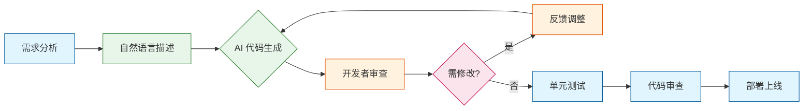

**流程图说明**：

- 传统编程中，**手动编码**（橙色）占据核心位置，是开发者投入时间最多的环节
- AI 编程中，**自然语言描述**和**AI 代码生成**（绿色）替代了手动编码，开发者聚焦于**审查优化**（橙色）
- AI 编程引入迭代反馈机制：代码可快速生成、评估、调整，形成"生成→审查→反馈→优化"的敏捷循环

#### AI 编程的八个阶段

美国著名程序员（前谷歌、亚马逊软件工程师）Steve Yegge（史蒂夫·耶奇）在2026年1月2号个人博客 Welcome to Gas Town 里提出 AI 编程有 8 级。

原文链接：[Welcome to Gas Town](https://steve-yegge.medium.com/welcome-to-gas-town-4f25ee16dd04)

- **Level 1**：无 AI 编程。「古典编程」，纯手写代码。
- **Level 2**：编辑器集成 AI 插件（如 `Copilot`、`Cursor`），提供代码补全和问题解答。
- **Level 3**：进入 `YOLO`（You Only Live Once）模式，信任 AI，放任其产出，一路单击 `Yes`。
- **Level 4**：AI 工作占比大，手动编码仅用于比对代码。
- **Level 5**：脱离编辑器，直接使用命令行。不在乎生成结果，只关心完成度。
- **Level 6**：单 AI 慢，开多个（3-5 个）AI 窗口并行编程。
- **Level 7**：AI 窗口超过 10 个，达到人工管理极限。
- **Level 8**：使用 AI「任务管理器」，指挥成百上千个 AI 同时工作。

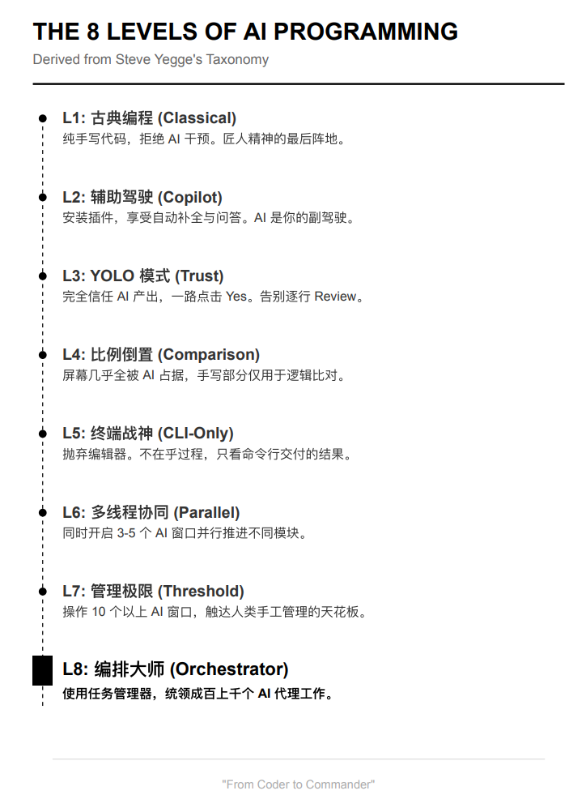

Yegge 本人属于 Level 8，他开发了 `Gas Town`（蒸汽小镇）来管理众多 AI。截止到目前该项目已获得 7.2k+ Star。

项目链接：[steveyegge/gastown](https://github.com/steveyegge/gastown)

### 1.3 AI 编程辅助开发的必要性

AI 编程辅助开发为何成为必然选择？以下从四个层面逐层剖析。

#### 1.3.1 个人层面：释放开发者创造力

**重复性工作消耗大量精力**

在实际开发中，开发者往往需要花费大量时间在重复性编码上：增删改查的 CRUD 代码、基础数据结构实现、常规错误处理等。这些工作虽然必要，但创造价值有限。AI 可以承担这些「dirty work」，让开发者聚焦于**架构设计**、**核心算法**、**业务逻辑**等高价值环节。

**降低记忆负担**

现代开发涉及众多框架、库、API，没有人能全部记住。传统模式下，开发者需要频繁查阅文档、搜索 Stack Overflow。AI 编程助手可以即时生成代码、解释 API 用法、纠正语法错误，让开发者将更多精力放在「做什么」而非「怎么做」上。

#### 1.3.2 团队层面：提升协作效率

**缩小技能差距**

团队成员的技术水平参差不齐。资深开发者可以专注于复杂问题，新手借助 AI 完成基础任务，整体产出更均衡。

**加速知识传递**

项目中的规范、架构决策、最佳实践可以通过 `Agent Skills` 固化为可复用的模板。新成员不再需要从零摸索，直接使用团队沉淀的技能库，快速上手。

#### 1.3.3 业务层面：加速产品迭代

**快速响应需求变化**

市场需求变化快，传统开发周期长、响应慢。AI 编程可以大幅缩短编码阶段的时间，让产品更快上线、更快试错、更快迭代。

**降低试错成本**

AI 可以快速生成多个方案供选择，降低了「想清楚再动手」的决策成本。开发者可以先让 AI 生成原型，验证思路后再深入优化。

#### 1.3.4 行业层面：应对人才与技术双重挑战

**人才短缺的全球性问题**

全球范围内，软件开发者需求持续增长，但供给严重不足。AI 编程辅助可以让现有开发者效率倍增，一定程度上缓解人才缺口。

**技术复杂度的指数级增长**

从单体应用 → 微服务 → 云原生 → AI 应用，软件系统的复杂度不断提升。AI 助手可以帮助开发者快速理解复杂系统、生成集成代码、降低上手门槛。

**行业生产力的整体跃迁**

每一次重大技术革新（汇编 → 高级语言 → 面向对象 → 互联网）都带来生产力跃升。AI 编程正成为下一个变革节点，早期掌握者将获得显著竞争优势。

#### AI 编程辅助开发的四层价值

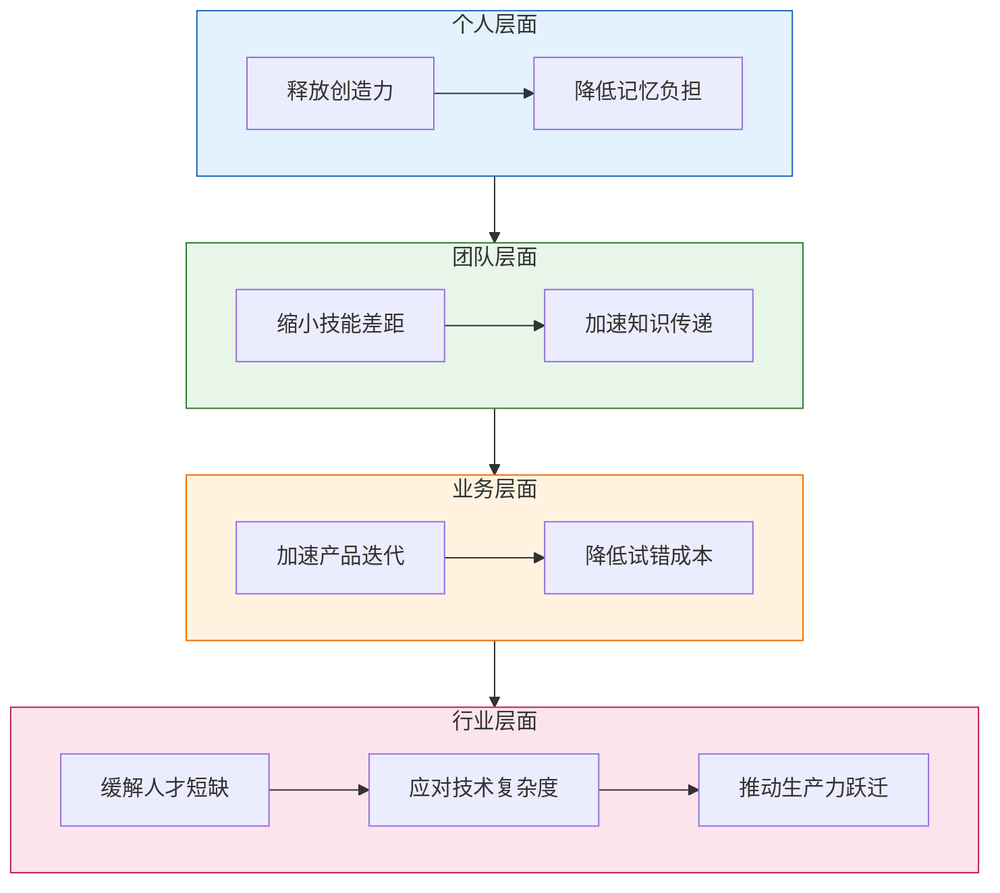

**图示说明**：

- **蓝色（个人）**：基础价值，释放开发者个体潜能
- **绿色（团队）**：协作价值，提升团队整体效能
- **橙色（业务）**：商业价值，加速产品市场响应
- **粉色（行业）**：社会价值，推动整个行业演进

---

AI 编程辅助开发不是「选项」，而是应对个人效率瓶颈、团队协作需求、业务快速迭代、行业人才与技术挑战的「必选项」。它不是替代开发者，而是放大开发者能力，让人类聚焦于创造，AI 聚焦于执行。

### 1.4 人机协作的新型开发范式

AI编程工具正在重塑开发流程，但真正的价值不在于替代开发者，而在于构建人机协作的新型开发范式。

#### 1.4.1 设计对话流

设计对话流本质是将人类的编程思维模式转化为AI可理解的结构化交互方式，通过明确的上下文管理和约束条件设置，引导AI生成符合预期的代码结果

设计对话流关注三个点：

- 上下文聚焦：要求单次对话仅处理一个功能模块，避免多任务混合导致的AI注意力分散。

- 约束明确化：通过具体指令减少AI的自由度，比如"仅修改X包下文件"、"必须复用Y工具类"。这些约束要尽可能具体，比如不说"遵循项目规范"，而是说"使用ResultDTO作为统一返回格式，错误码规则参考ErrorCodeEnum"。

- 增量式提问：采用"先框架后细节"的提问策略，先让AI生成接口定义和整体框架，待确认后再逐步深入实现细节。这种方式很像带新人时"先搭骨架再填肉"的指导方法

提示词明确四件事：

- 当前任务的功能边界和目标（做什么，不做什么。）

- 必须遵守的技术约束和规范（用什么技术栈，遵循什么标准。）

- 期望的输出格式和交付物（要代码？要文档？还是两者都要？）

- 分阶段的实现计划（先设计接口，再实现逻辑，最后写测试。）

#### 1.4.2 计划模式（Plan Mode）

初期使用 AI 编程遇到的问题：

- 实现逻辑不完整，有些边界情况根本没考虑到。

- 模块间接口设计不一致，调用起来磕磕绊绊。

- 技术选型不合理，用了个"看起来很酷但项目中并不适用"的方案。

根据市场占有率和使用频率整理的十大 AI 编程提示词排行榜：

1. **给我生成完整可运行的代码**（18.762%）
   最高频的提示词，用户期望 AI 直接生成可直接使用的代码片段，适用于快速原型开发或解决具体编程问题。

2. **用中文回答**（16.543%）
   中文用户常用的提示词，确保 AI 输出结果以中文呈现，便于理解和后续修改。

3. **我说了要复用现有接口**（14.891%）
   强调代码复用性，避免 AI 生成重复或冲突的接口代码，提高开发效率和代码一致性。

4. **别又给我生成一堆 TODO**（12.337%）
   用户希望 AI 直接提供完整解决方案，而非留下大量待处理的 TODO 标记，减少后续维护成本。

5. **为什么又引入新依赖**（10.984%）
   关注代码依赖管理，避免 AI 引入不必要的第三方库或工具，降低项目复杂性和维护难度。

6. **这个错误你上次就犯过**（9.215%）
   用于提醒 AI 避免重复出现已知错误，提高代码质量和稳定性。

7. **别自作聪明优化**（7.638%）
   部分用户希望 AI 遵循既定规范和需求，避免过度优化导致代码可读性下降或引入新问题。

8. **这个 API 根本不存在**（6.492%）
   用于纠正 AI 生成的错误 API 引用或调用，确保代码与实际系统接口一致。

9. **还是报错**（5.871%）
   用户反馈代码仍存在错误时的常用提示词，促使 AI 重新分析和修复问题。

10. **注释和代码对不上**（4.923%）
    强调代码注释与实际功能的一致性，便于团队协作和代码维护。

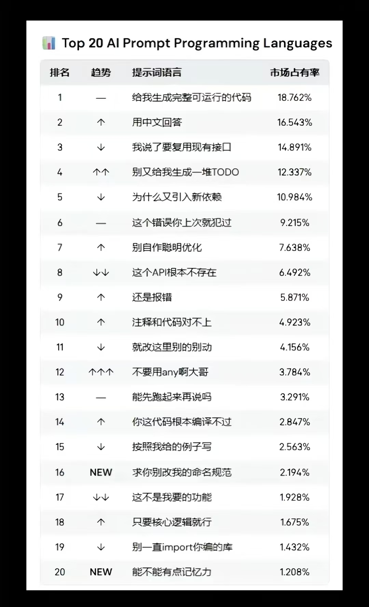

解决方法：拆解复杂问题，把大问题拆分成小问题，而Plan模式正是借鉴了项目管理中的WBS（工作分解结构）思想

Plan模式使用三步法分解需求：

- 需求分析与模块划分：把整体需求分解为独立的功能模块。

- 技术方案设计：为每个模块确定实现思路和技术选型。

- 任务优先级排序：根据依赖关系和重要性确定实现顺序。

实践示例：

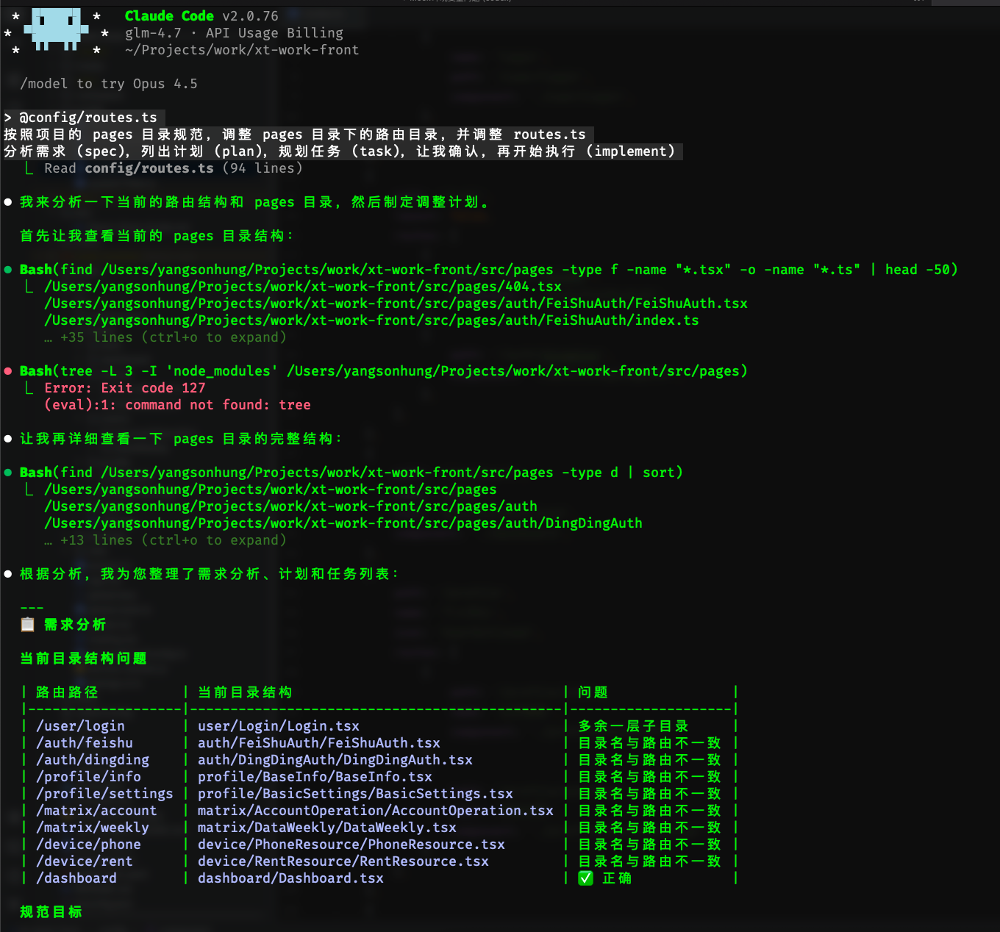

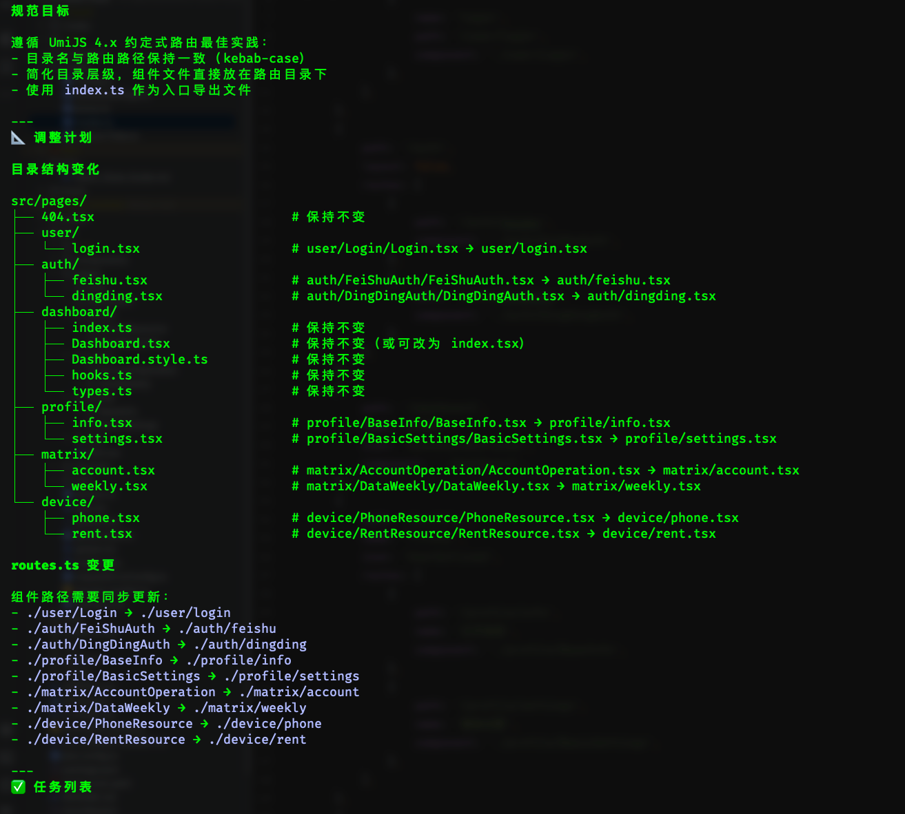

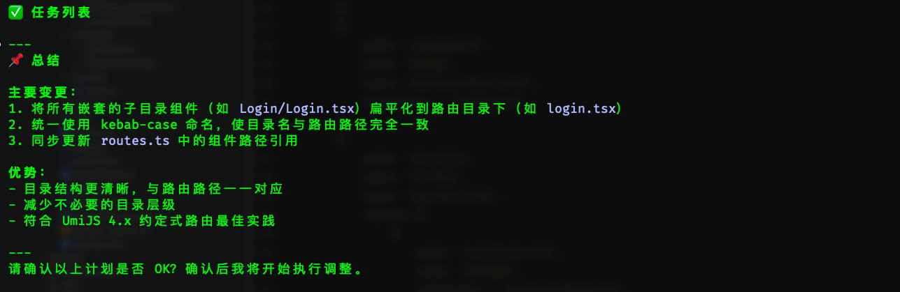

### 1.5 AI 编程的局限性与挑战

AI 编程虽然强大，但并非万能。开发者在实际使用中常遇到以下三类核心问题：

#### 1.5.1 需求表达不完整

- **场景一**：开发者说"实现一个商家信息查询接口"，AI 生成了基础的 CRUD 代码，但没有考虑商家数据权限、数据脱敏、缓存策略等实际业务需求。

- **场景二**：实现任务时，只描述了"需要任务分配功能"，结果 AI 生成的代码没有处理任务池、任务优先级、分配策略等核心逻辑。

#### 1.5.2 上下文管理混乱

- **场景一**：一个对话持续了十几轮后，AI 开始忘记前面确定的"使用 MyBatis-Plus + BaseMapper"的设计决策，擅自改成了 JPA Repository 模式。

- **场景二**：在实现相关功能时，早期确定的 DTO 转换规范在后续模块中被遗忘，导致代码风格不一致。

#### 1.5.3 迭代反馈滞后

- **场景一**：等 AI 生成完整的 Service + Controller + Repository 代码后才发现方向不对，比如数据库表设计与现有架构冲突，不得不从头再来，浪费了大量时间。

- **场景二**：实现触达功能时，生成的飞书消息发送代码没有考虑现有的 `FeishuClient` 封装，重复造了轮子。

---

**应对策略**：

| 挑战 | 应对方法 |
|------|----------|
| 需求表达不完整 | 使用 Plan 模式分阶段确认，使用 Agent Skills 沉淀需求模板 |
| 上下文管理混乱 | 控制单次对话粒度，定期回顾设计决策，使用 CLAUDE.md 传递上下文 |
| 迭代反馈滞后 | 先让 AI 生成接口定义和框架，确认后再实现细节，避免一次性生成完整代码 |

#### 依赖 AI 编程的的威危害

用 AI 辅助写代码，会不会让程序员变得更菜？

论文：<https://arxiv.org/abs/2601.20245>

Anthropic 官方博客：<https://www.anthropic.com/research/AI-assistance-coding-skills>

### 1.6 AI 编程能力图谱：纵向深度与横向广度

纵向看：

- 3年前向 ChatGPT 提问代码，再把他的回答粘贴到 IDE

- 2年前用 Cursor 辅助开发

- 1年前用 Cursor Agent、CC、CodeX 跑小任务

- 今年尝试用 YOLO 模式全托管跑项目

这一路学习的能力：

- prompt 能力

- 项目规划、SPEC 文档的编写能力

- Cursor Rule、Constitution 等约束的编写能力

只有掌握了上述能力，才能在“约束明确的项目”中，描述“定义清晰的任务”。而这是全托管模式下 AI 能顺利完成任务的先决条件。

横向看：

- 3年前了解了 Function Call、Tool use，这是接口

- 2年前了解了 MCP，这是规范

- 1年前了解了 Agent Skill，这是功能

从只有程序员的自娱自乐（各种造MCP）到各行各业专业人士都能写 Skill，这意味着能力边界随着 AI 能力边界的扩张也具象化地扩张

举例：一个程序员通过专业的选题、分析、写稿 Skill 也能成为专业的自媒体博主

## 二、`Agent Skills` 核心概念

Claude Code 官方：<https://claude.com/blog/skills>

Agent Skills 主页：<https://agentskills.io/home>

### 2.1 `Agent Skills` 定义与工作原理

Skills 是模块化的、自包含的能力包，通过提供专门的知识、工作流和工具来扩展 AI Agent 的能力。它们就像是针对特定领域或任务的“入职指南”，将通用的 AI Agent 转变为具备专业程序性知识的专家。

#### Skills 能提供什么

- 专业工作流：针对特定领域的自动多步骤程序。

- 工具集成：处理特定文件格式或 API 的指令。

- 领域专业知识：公司特定的知识、架构和业务逻辑。

- 打包资源：用于复杂和重复任务的脚本、参考资料和资产。

#### 通过 Skills 能做什么

- 封装专业知识：将特定领域的最佳实践和操作流程封装成可复用的技能

- 提供工作流模板：定义标准化的任务处理流程，提高工作效率

- 扩展 AI 能力：让 AI 助手能够处理更专业、更复杂的任务

- 团队协作共享：项目级 Skills 可以在团队成员间共享专业知识

### 2.2 技术对比分析

在 AI Agent 生态系统中，**Prompt**、**Agent Skills**、**MCP** 是三个核心概念，它们处于不同层级，服务于不同目的。

#### 2.2.1 基本概念

| 技术 | 全称 | 定位 |
|------|------|------|
| **Prompt** | Prompt Engineering | 交互指令：与 AI 对话时输入的文本 |
| **Agent Skills** | Agent Skills | 能力包：封装专业知识、工作流和工具 |
| **MCP** | Model Context Protocol | 连接协议：AI 与外部工具/数据源的通信标准 |

#### 2.2.2 三者对比

| 维度 | Prompt | Agent Skills | MCP |
|------|--------|--------------|-----|
| **关注点** | 如何描述需求 | 能做什么 | 如何连接 |
| **抽象层级** | 顶层交互 | 中层能力 | 底层协议 |
| **作用范围** | 单次对话 | 任务级别 | 工具级别 |
| **内容形式** | 自由文本 | Markdown + 资源 | JSON Schema + 代码 |
| **持久化** | 会话级（临时） | 文件级（持久） | 服务级（持久） |
| **复用粒度** | 最小（单条指令） | 中等（功能模块） | 较大（工具集成） |
| **使用者** | 最终用户 | 任务使用者 | 工具开发者 |

#### 2.2.3 比喻理解

| 概念 | 比喻 |
|------|------|
| **Prompt** | 「对话」：你告诉 AI 要做什么 |
| **Agent Skills** | 「技能手册」：AI 根据手册执行任务 |
| **MCP** | 「USB 接口」：AI 通过它连接外部工具 |

#### 2.2.4 协同关系

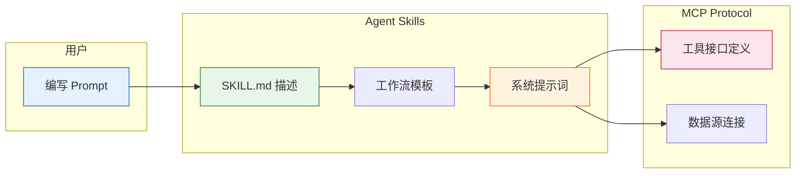

**调用链路**：用户 Prompt → Skills（解析意图）→ MCP（调用工具）→ 执行结果 → 返回用户

#### 2.2.5 协同示例

| 场景 | Prompt 示例 | Skills 提供 | MCP 提供 |
|------|-------------|-------------|----------|
| 代码审查 | "帮我审查这个 PR" | 审查流程、维度 | Git 操作 |
| 数据库查询 | "查一下今天的订单" | 查询模板、SQL 规范 | 数据库连接 |
| 文件重构 | "重构这个模块" | 重构步骤、模式 | 文件读写 |

#### 2.2.6 选型指南

| 场景 | 推荐 |
|------|------|
| 单次简单任务 | 直接写 Prompt |
| 团队规范复用 | 使用 Skills |
| 连接外部工具 | 使用 MCP |
| 完整解决方案 | Skills + MCP + 优化 Prompt |

Prompt 是「入口」，Skills 是「能力」，MCP 是「连接」。三者协同：用户通过 Prompt 发起请求，Skills 解析并执行任务，MCP 连接外部工具，最终完成用户需求。

### 2.3 `Agent Skills` 标准规范

每个 Skill 由一个必需的 SKILL.md 文件和可选的打包资源组成。Skill 位于用户目录下的.claude/skills 目录下

```txt
skill-name/
├── SKILL.md              # 必需：技能说明文档
├── scripts/              # 可选：可执行脚本
│   ├── example.py
│   └── helper.sh
├── references/           # 可选：参考文档
│   ├── schema.md
│   └── api_docs.md
└── assets/               # 可选：输出资源
    ├── templates/
    └── logo.png
```

#### SKILL.md 结构（必需文件）

##### YAML 前置元数据

```yaml
---
name: skill-name                    # 必需
description: 详细描述技能功能和使用场景  # 必需（触发机制）
license: Complete terms in LICENSE.txt  # 可选
compatibility: 环境要求               # 可选（极少需要）
---
```

##### Markdown 正文

包含使用说明、工作流程和最佳实践

#### 可选资源目录说明

##### 1. **scripts/** - 可执行脚本

**用途**：需要确定性可靠性或重复编写的代码

- Python/Bash 等可执行文件
- **优势**：节省 token、确定性强、可能无需加载到上下文即可执行
- **示例**：`rotate_pdf.py` 用于 PDF 旋转任务

##### 2. **references/** - 参考文档

**用途**：需要时加载到上下文的文档材料

- 数据库模式、API 文档、公司政策等
- **优势**：保持 SKILL.md 精简，按需加载
- **最佳实践**：
  - 大文件（>10k 词）应在 SKILL.md 中包含 grep 搜索模式
  - 避免重复：信息应位于 SKILL.md 或 references 中，而非两者都有
  - 详细的参考资料应放在这里，而非 SKILL.md

##### 3. **assets/** - 输出资源

**用途**：不加载到上下文，而是在输出中使用的文件

- 模板、图片、图标、字体、样板代码
- **示例**：品牌 logo、PowerPoint 模板、前端样板
- **优势**：分离输出资源与文档，无需加载即可使用

## 三、`Agent Skills` 实战应用

### 3.1 优质 `Agent Skills` 资源获取

<https://skillsmp.com/>

### 3.2 `Agent Skills` 创建实践

创建 Skill 有两种方式：**手写**和**使用工具**。手写适合学习原理和创建简单技能；使用 `skill-creator` 工具可以快速生成标准化结构，适合批量创建。

#### 3.2.1 手写 `Agent Skills` 入门

**最小结构**：

```
my-skill/
├── SKILL.md    # 必需：技能说明文档
```

**SKILL.md 模板**：

```markdown
# 技能名称

## 功能描述
简要说明这个技能能做什么。

## 使用场景
- 场景一：...
- 场景二：...

## 使用方法
```

/skill-name [参数]

```

## 注意事项
- ...
```

**完整结构**（可选资源）：

```
my-skill/
├── SKILL.md              # 必需：技能说明文档
├── scripts/              # 可选：可执行脚本
│   ├── setup.sh
│   └── deploy.py
├── prompts/              # 可选：提示词模板
│   └── system-prompt.md
└── resources/            # 可选：参考资料
    └── readme.md
```

**入门示例：创建「代码审查」Skill**

```markdown
# 代码审查

## 功能描述
提供标准化的代码审查流程，检查代码质量、安全性和可维护性。

## 使用场景
- 代码提交前的自检
- Pull Request 审查
- 代码重构前的评估

## 使用方法
```

/code-review [文件路径或 git diff]

```

## 审查维度
1. **代码规范**：命名、注释、格式
2. **安全漏洞**：SQL 注入、XSS、敏感信息
3. **性能问题**：循环、数据库查询、资源泄漏
4. **测试覆盖**：单元测试、集成测试
```

#### 3.2.2 使用 `skill-creator` 快速创建通用 Skill

**安装方式**：

```bash
# 通过 Claude Code 安装
/skill skill-creator

# 或 npm 全局安装
npm install -g skill-creator
```

**创建步骤**：

1. **启动工具**

   ```bash
   skill-creator create
   ```

2. **填写基本信息**

   ```
   Skill 名称：my-utility-skill
   简短描述：常用工具函数集合
   作者：your-name
   版本：1.0.0
   ```

3. **选择模板**

   ```
   模板类型：
   1. 通用工具（General Utility）
   2. 前端组件（Frontend Component）
   3. 后端服务（Backend Service）
   4. 文档生成（Documentation）
   ```

4. **生成结构**

   ```
   my-utility-skill/
   ├── SKILL.md
   ├── prompts/
   │   └── system-prompt.md
   ├── scripts/
   │   └── main.py
   └── resources/
       └── examples.md
   ```

**配置文件示例**：

```yaml
# skill.yaml
name: my-utility-skill
version: 1.0.0
description: 常用工具函数集合
author: developer
tags:
  - utility
  - tools
  - helpers
capabilities:
  - 生成常用工具函数
  - 代码片段复用
  - 快速原型开发
```

#### 3.2.3 使用 `skill-creator` 创建项目开发 Skill

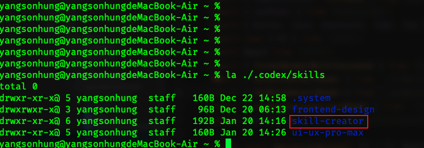

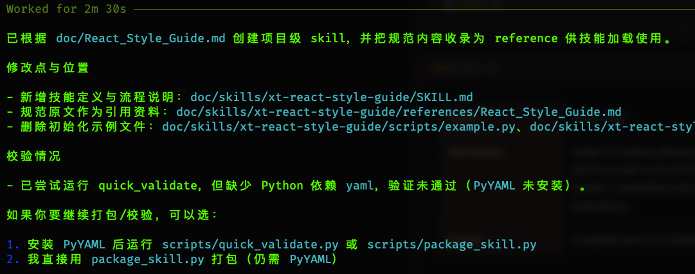

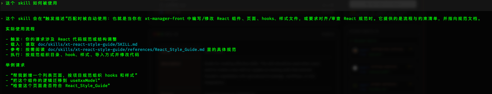

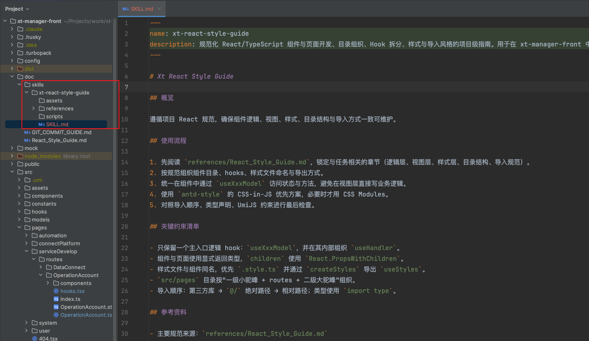

### 3.3 前端框架 Skills 开发最佳实践

前端框架官方与社区已开始认真参与"AI 如何写好代码"这件事。React 和 Vue 官方或社区已发布专属 Skills，标志着 AI 编程进入新阶段。

#### 3.3.1 React Skills

官方仓库：[vercel-labs/agent-skills - react-best-practices](https://github.com/vercel-labs/agent-skills/tree/main/skills/react-best-practices)

**核心内容**：

| 模块 | 说明 |
|------|------|
| 组件设计 | 函数组件 vs Class 组件、Hooks 使用规范 |
| 状态管理 | useState、useReducer、useContext、Zustand、Redux Toolkit |
| 性能优化 | useMemo、useCallback、React.memo、代码分割 |
| 样式方案 | CSS Modules、Styled Components、Tailwind CSS |
| 测试规范 | Jest、React Testing Library、Playwright |

**示例规则**：

```markdown
# React 最佳实践

## 组件编写
- 优先使用函数组件 + Hooks
- 自定义 Hooks 以 `use` 开头
- 保持组件小而纯，职责单一

## 状态管理
- 本地状态用 useState
- 跨组件状态用 useContext 或 Zustand
- 复杂状态逻辑用 useReducer

## 性能规则
- 避免过度使用 useMemo/useCallback
- 列表渲染必须加 key
- 大列表使用虚拟滚动
```

#### 3.3.2 Vue Skills

官方仓库：[vuejs-ai/skills](https://github.com/vuejs-ai/skills/blob/main/README.md)

**核心内容**：

| 模块 | 说明 |
|------|------|
| 组合式 API | script setup、ref、reactive、computed |
| 响应式系统 | watch、watchEffect、computed |
| 组件通信 | props、emits、provide/inject、Pinia |
| 路由规范 | Vue Router 配置、导航守卫 |
| 状态管理 | Pinia 状态设计、持久化 |

**示例规则**：

```markdown
# Vue 3 最佳实践

## 组件定义
- 优先使用 <script setup> 语法
- 组件名用 PascalCase
- props 定义需声明类型和校验

## 响应式规则
- 优先用 ref 定义基本类型
- 用 reactive 定义对象
- 避免解构响应式对象（丢失响应性）

## 状态管理
- 全局状态用 Pinia
- 模块化组织，按功能拆分
```

#### 3.3.3 共性最佳实践

| 维度 | 前端通用规范 |
|------|--------------|
| **目录结构** | 按功能或页面组织，而非按文件类型 |
| **命名规范** | 组件用 PascalCase，文件用 kebab-case |
| **代码分割** | 路由懒加载、组件异步加载 |
| **类型安全** | 优先使用 TypeScript，明确类型定义 |
| **测试覆盖** | 组件单元测试 + E2E 测试 |
| **可访问性** | semantic HTML、ARIA 标签、键盘导航 |

#### 3.3.4 创建前端 Skill 的要点

1. **框架版本明确**
   - 标注支持的框架版本（如 React 18+、Vue 3）
   - 说明与旧版本的差异

2. **生态集成**
   - UI 组件库（Ant Design、Element Plus、Vuetify）
   - 状态管理（Pinia、Redux Toolkit）
   - 路由（React Router、Vue Router）

3. **工程规范**
   - ESLint 配置
   - Prettier 格式化
   - Git Hooks（husky、lint-staged）

4. **示例代码**
   - 典型场景的完整示例
   - 常见错误的修复示例

前端官方与社区参与 Skill 建设，意味着 AI 助手正从"代码生成器"进化为"理解框架规范、工程经验和最佳实践的虚拟同事"。这才是 AI 开发真正走向成熟的标志。

### 3.4 `Agent Skills` 集成应用

#### 3.4.1 IDE 集成：`CodeBuddy` 使用指南

#### 3.4.2 `CLI` 集成：`Codex/Claude Code` 实战

### 3.5 精选 `Agent Skills` 推荐与分享

#### 3.5.1 官方推荐 Skills

| Skill 名称 | 定位 | 适用场景 | 仓库链接 |
|------------|------|----------|----------|
| **skill-creator** | 技能生成器 | 创建自定义 Skill | [GitHub](https://github.com/anthropics/skills/tree/main/skills/skill-creator) |
| **frontend-design** | 前端设计优化 | 提升 AI 生成页面的视觉质量 | [GitHub](https://github.com/anthropics/skills/blob/main/skills/frontend-design/SKILL.md) |
| **superpowers** | 开发工作流框架 | 规范驱动的大型项目开发 | [GitHub](https://github.com/obra/superpowers) |

#### 3.5.2 技能详解

##### skill-creator（技能生成器）

- **简介**：Agent 的元技能。通过引导式对话，将脑海中的想法或 SOP 自动转化为符合标准的 `SKILL.md` 文件。
- **适合场景**：
  - 现有 Skill 无法满足特定需求（如对接公司内部 ERP）
  - 企业将业务流程（SOP）标准化并分发给 AI 使用
- **适合人员**：开发者、Prompt 工程师、企业 IT 管理员、超级个体

##### frontend-design（前端设计优化）

- **简介**：Anthropic 官方出品，解决 AI 生成页面"千篇一律"的问题。
- **核心能力**：
  - 选择独特的字体组合（非默认 Arial/Inter）
  - 使用更有视觉冲击力的配色方案
  - 根据设计风格匹配实现复杂度
- **使用建议**：搭配 React + Tailwind 效果更佳
- **注意事项**：主要改善视觉设计，交互逻辑和业务功能仍需人工把关
  **网站**：<https://ui-ux-pro-max-skill.nextlevelbuilder.io/#>

##### superpowers（开发工作流框架）

- **简介**：一整套软件开发工作流框架，规范驱动开发（SDD）的 Skills 版本。
- **核心三板斧**：
  1. `/superpowers:brainstorm` — 需求探索和设计
  2. `/superpowers:write-plan` — 拆分实现计划
  3. `/superpowers:execute-plan` — 分批执行
- **工程实践**：强制 TDD（测试驱动开发）
- **附加能力**：代码审查、系统化调试、Git Worktree 管理等十几个子 Skills
- **适用人群**：觉得 Claude Code 写代码太"莽"的同学

#### 3.5.3 更多资源

- [Agent Skills 官方主页](https://agentskills.io/home)
- [Skills MP](https://skillsmp.com/)
- [Anthropic Skills 仓库](https://github.com/anthropics/skills)

## 四、总结与展望

### 4.1 关键要点回顾

本次分享围绕 AI 编程辅助开发和 `Agent Skills` 进行了全面探讨，核心要点如下：

| 章节 | 核心观点 |
|------|----------|
| **第一章** | AI 编程不是替代开发者，而是放大开发者能力，从"执行者"向"指挥者"转变 |
| **第二章** | Agent Skills 是封装专业知识、工作流和工具的能力单元，可与 MCP 协同 |
| **第三章** | Skills 可手写或用 skill-creator 创建，前端官方已积极参与 AI 编程规范建设 |

**能力跃迁路径**：

```
Level 1: 传统编程（纯手写）
   ↓
Level 2: AI 辅助（Copilot 代码补全）
   ↓
Level 3: AI 协作（Plan 模式、对话流设计）
   ↓
Level 4: Agent 驱动（Skills + MCP + 自动化工作流）
```

### 4.2 团队应用建议

#### 4.2.1 起步阶段

| 动作 | 说明 |
|------|------|
| 安装 AI 编程工具 | Cursor、Claude Code、VSCode + Copilot |
| 编写 CLAUDE.md | 传递项目上下文和规范 |
| 试用官方 Skills | 如 frontend-design、skill-creator |

#### 4.2.2 建设阶段

| 动作 | 说明 |
|------|------|
| 沉淀团队规范 | 将编码规范、最佳实践固化为文档 |
| 创建项目 Skills | 用 skill-creator 生成项目专属 Skills |
| 建立反馈机制 | 收集 AI 编程中的问题和改进建议 |

#### 4.2.3 规模化阶段

| 动作 | 说明 |
|------|------|
| 分享与复用 | 将优秀 Skills 在团队/社区分享 |
| 持续优化 | 根据项目反馈迭代 Skills 内容 |
| 培训推广 | 组织培训，让更多成员掌握 AI 编程 |

#### 4.2.4 避坑指南

- **不要**一次性让 AI 生成完整模块（容易失控）
- **不要**忽视 AI 生成代码的审查
- **不要**过度依赖 AI 而丧失独立思考能力
- **要**保持对代码的主导权

### 4.3 未来发展趋势

#### 4.3.1 技术演进方向

| 趋势 | 说明 |
|------|------|
| **专业化** | 官方 Skills 覆盖更多框架和场景 |
| **自动化** | 从人工编写 Skills 到 AI 自动生成 Skills |
| **协作化** | Skills 市场形成，开发者可买卖共享 |
| **标准化** | 行业统一的 Skills 规范和接口标准 |

#### 4.3.2 角色转变

```
过去：程序员 = 编码执行者
未来：程序员 = AI 指挥者 + 架构设计师 + 质量把关人
```

**核心能力迁移**：

| 传统能力 | AI 时代能力 |
|----------|-------------|
| 记忆 API | 提问能力 |
| 手动调试 | 代码审查 |
| 逐行编写 | 方案设计 |
| 独立开发 | 人机协作 |

#### 4.3.3 行业影响

- **开发者**：效率提升 3-5 倍，聚焦创造性工作
- **企业**：降低用人门槛，加速产品迭代
- **教育**：编程教育重心从"语法"转向"思维"
- **生态**：工具链重构，Skills 成为新的"开源项目"

### 4.4 Q&A 环节

**Q1：AI 编程会取代程序员吗？**

A：不会。AI 是工具，不是替代者。AI 擅长执行重复任务，但需求理解、架构设计、代码审查仍需人类。未来的优秀程序员是那些能驾驭 AI 的人。

**Q2：如何选择 AI 编程工具？**

A：根据团队需求：

- 个人/小团队：VSCode + Copilot
- 中型项目：Cursor
- 大型项目/企业：Claude Code + Skills

**Q3：Skills 和 MCP 都要学吗？**

A：建议顺序：

1. 先掌握 Prompt（入门简单，效果立竿见影）
2. 再学习 Skills（提升复用性）
3. 最后了解 MCP（深度集成外部工具）

**Q4：如何说服团队采用 AI 编程？**

A：从痛点入手：

- 展示效率提升（用实际项目对比）
- 提供培训支持（降低学习成本）
- 建立规范（打消质量顾虑）
- 小范围试点（验证效果后再推广）

**Q5：个人如何持续学习？**

A：

- 关注官方文档（Anthropic、Cursor）
- 参与社区讨论（GitHub、Discord）
- 动手实践（创建自己的 Skills）
- 分享输出（写博客、做分享）

---

**结语**：AI 编程时代已经到来。Agent Skills 是连接人类智慧与 AI 能力的桥梁。掌握 Skills，就是掌握 AI 时代的生产力工具。开始你的 AI 编程之旅吧！
